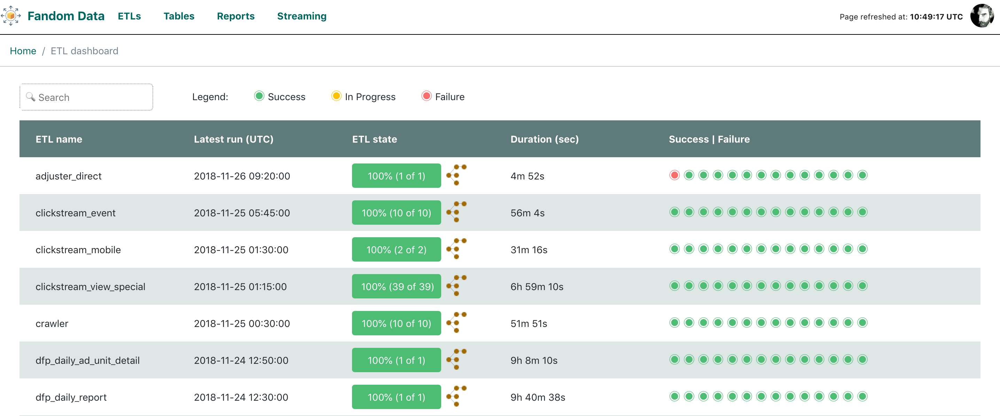

# DiscreETLy

**DiscreETLy** is an add-on dashboard service on top of [Apache Airflow](https://github.com/apache/incubator-airflow). It is a user friendly UI showing status of particular DAGs. Moreover, it allows the users to map Tasks within a particular DAG to tables available in any system (relational and non-relational) via friendly yaml definition. **DiscreETLy** provides fuctionality for monitoring DAGs status as well as optional communication with services such as [Prometheus](https://prometheus.io/) or [InfluxDB](https://www.influxdata.com/).



## Prerequisites

Minimal setup required to run the dashboard requires `docker`. You can find docker installation instructions on
[official docker website](https://docs.docker.com/install/).

The minimal setup requires also access to Airflow MySQL instance (MySQL version should be >= 8 and allow analytical functions).

## Configuration

Before running or deploying **DiscreETLy** a configuration file needs to be provided. The template for configuration
file can be found in `config` folder: `settings.py.template`. Configuration is provided as a standard python file,
which makes it easy to define and change utilizng Python APIs. The bare minimum configuration needed for the app to run requires definition of a secret key (stub provided in template document) and connection details for Airflow database (currently only MySQL is supported).

Configuration options for InfluxDB and Prometheus are optional. If those services are not defined in configuration
file they will be simply ignored while running the app.

If environment is not specified, the application is run in DEBUG mode, so any errors will be reported on dashboard UI. If environment variable `ENV_VAR_PREFIX` is set to `PROD` or appropriate
option is changed in `settings.py` file the application will serve `500` errors as defined in dashboard [template](dashboard/blueprints/page/templates/500.html).

### Configuring dashboard views

#### Tables

The basic configuration file is enough to run the dashboard, however, in order to take
full advantage of dashboard features and functionality there are some additional steps
that need to be performed.

The dashboard allows the users to monitor the progress of particular Airflow DAGs and
tasks, moreover, it can also show the status of tasks in relation to tables they populate
with data.

However, Airflow does not contain the mapping between tables (Hive, database) and that is
why a mapping needs to be provided to **discreETLy**. A mapping can be defined in
`tables.yaml` file available in `config` folder. Each mapping consists of a few pieces of information:

- `name` - the name of the table in a database
- `db` - a database definition (can be a namespace)
- `uses` - a table that provides data for the task populating currently describe table (helps if there are dependencies between tables)
- `dag_id` - id of a DAG that contains the task required for the mapping
- `task_id` - id of the task that populates the table

The application will automatically ingest the definition of the tables and map them to particular tasks.

#### Reports

The dashboard allows to monitor sets of tables that constitute to a report that is maintained by DE team or stakeholders.

The definition of the set of tables and general report metadata can be
found in `reports.yaml` file available in `config` folder.

Please, refer to `report.yaml.template` to learn more about particular options that
need to be provided.

#### External ETLs

Not all ETLs are always defined through Airflow. Data engineering field is rich and
complex and requires a plethora of tools to ensure high quality of operations. Should there be any ETLs defined outside of Airflow that need to be maintained and
monitored they can be defined in `extra_etl.yaml` file available in `config` folder. Due to the fact that it is impossible to predict the availability of metadata for
those definitions separate links need to be provided to point to external monitoring systems.

In order to display information related to any external ETLs there are some additional steps required:

- setting `EXTRA_ACTIVE` option in configuration to true,
- providing a custom jinja template named `extra.html` in `dashboard/blueprints/page/templates`. An example of such template is available [here](examples/extra.html),
- providing custom logic for data processing in `dashboard/blueprints/page/view.py` method `extra_dashboard` to process and enrich the data.

## Running locally

Before running the container with app we first need to build it so it becomes available
in our local docker repository. Run the following command from project's root directory.

```bash
docker build -t <image_name>:<image_version> .
```

Once the image is build the application can be triggered by running:

```bash
docker run -e <env_name>=<env_value> --rm --name <container_name> -v <project_root_folder>:/app -p 8000:8000 <docker_image_name>:<image_version>
```

Let's dissect this command option by option:

- `-e` flag allows to set up different evnvironment varaibles required to e.g. configure the app. Most of those options can be hardcoded in configuration file, however, passing them through environment is recommended. For more detials see **[configuration](#configuration)** section of this README.
- `--rm` removes the container after stopping it. It ensures that there is always a fresh version of conpfiguration and other features while running the app.
- `-v` maps folders containing application from local environment to container. It ensures that if in development mode all changes applied to files on local file system are immediately reflected in container.
- `-p` maps a port from container to `localhost`

If some of the configuration options are already available through `settings.py` file the command for running the application can be significantly abbreviated (from project root folder):

```bash
docker run --rm -v $(pwd):/app -p 8000:8000 discretely:latest
```

Remember to use docker image name and version provided during `build` stage.

Once the container is ready and running navigate to `localhost:8000` in a browser and enjoy.

### Testing

In order to run the tests a docker image needs to be build first. The Dockerfile is available in `dashboard/tests/` folder. To build an image one can run the following command from project's root directory:

```bash
docker build -t dashboard:tests -f dashboard/tests/Dockerfile .
```

Once the image is build the tests can be preformed by typing

```bash
docker run --rm dashboard:tests
```

The output of this command shows a nicely formatted information of number of tests performed and success ratio (all tests are performed by using `pytest` package).

If working iteratively rebuilding the image everytime some changes are made would be cumbersome. In order to avoid that one can pass additional parameter to subsequent runs (mapping of a local project folder to container destination):

```bash
docker run --rm -v <absolute_path_to_project_root_directory>:/tmp/dashboard/ dashboard:tests
```