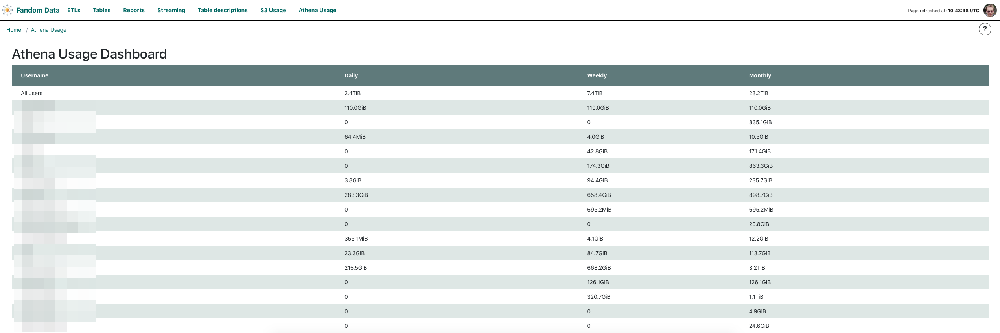

# Athena Usage plugin

Athena Usage shows summarised daily, weekly and monthly data usage in Athena queries for an `executing_user`.
This plugin aims to help users track their queries' efficiency.

Relies on accessing `QUERIES_TABLE`, storing queries' info.

This plugin configuration is stored as `ATHENA_USAGE_PARAMS`:
```
ATHENA_USAGE_PARAMS = {
    'QUERIES_TABLE': '....',
    'region_name': '....',
    'aws_access_key_id': '....',
    'aws_secret_access_key': '....'}
```
 * `QUERIES_TABLE` - name of the table where queries' metadata are stored
 * `region_name` - AWS region where `QUERIES_TABLE` is stored
 * `aws_access_key_id` and `aws_secret_access_key` - credentials to be used to communicate
   with AWS API


