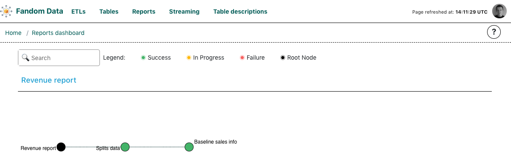

# Reports View

The dashboard allows to monitor sets of tables that constitute to a report that is maintained by DE team or stakeholders.

The definition of the set of tables and general report metadata should be places as 
`reports.yaml` file in `config` folder.

Please, refer to [reports.yaml.template](reports.yaml.template) to learn more about particular options that
need to be provided. Reports plugin requires valid [tables.yaml](../tables/tables.yaml.template) to be
provided to match tables from `reports.yaml` with corresponding DAGs and tasks.

