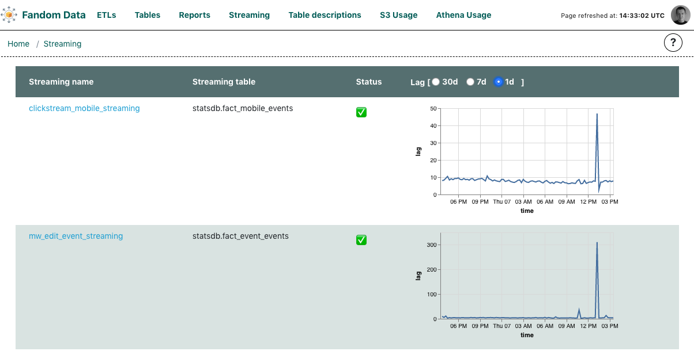

# Streaming applications view

The Streaming tab lists the applications that consume a data streams and put the records
to the Data Warehouse. Each row contains a stream name, link to external monitoring screen
(for example AWS Kinesis Monitoring tab) and status of the stream. Also a time series chart
is presented, showing the lag of stream consumption (values are provided by LagProvider 
implementation and currently only InfluxDB is supported).

Status is based on the alerts provided by Prometheus, but assigned to the tables that
are filled by dumping the stream. The configuration file requires you to provide a list 
of entries with the following keys:
- `name` - name of stream to be displayed on the dashboard
- `link` - link to external monitoing site (can be empty)
- `table` - name of the table that stores data dumped by the streaming application

You can find more details in the [example file](streaming.yaml.template). For the plugin
to work the file should be named `streaming.yaml` and needs to be put in `config` directory.
Streaming plugin requires valid [tables.yaml](../tables/tables.yaml.template) to be
provided to match alerts for tables mentioned in `streaming.yaml`.

