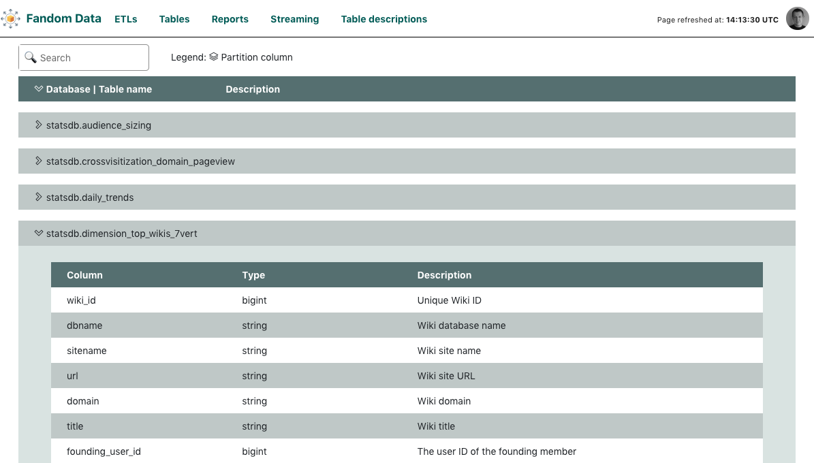

# Table descriptions View

Table descriptions tab displays table and column descriptions (comments). 
This can be useful for stakeholders to better understand your data structure and search for particular information. 
The implementation takes them from AWS glue which stores comments added during table creation. 
Since not all tables have to have comments provided, this tab is fully optional.  
Comments for tables and fields are editable using the UI and will be commited to AWS Glue data store.  

Table descriptions plugin requires valid [tables.yaml](../tables/tables.yaml.template) to be
provided to provide a subset of the tables to be displayed.

