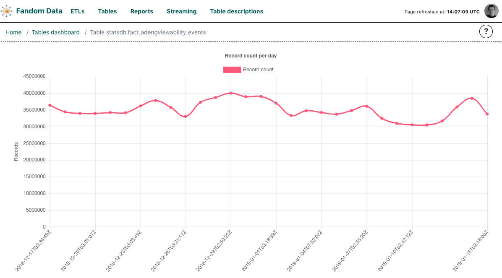

# Tables View

The dashboard allows the users to monitor the progress of particular Airflow DAGs and
tasks, moreover, it can also show the status of tasks in relation to tables they populate
with data.

However, Airflow does not contain the mapping between tables (Hive, database) and that is
why a mapping needs to be provided to **discreETLy**. A mapping can be defined in
`tables.yaml` file available in `config` folder. Each mapping consists of a few pieces of information:

- `name` - the name of the table in a database
- `db` - a database definition (can be a namespace)
- `uses` - a table that provides data for the task populating currently describe table (helps if there are dependencies between tables)
- `dag_id` - id of a DAG that contains the task required for the mapping
- `task_id` - id of the task that populates the table
- (optional) 

Additionally you may want to provide cadence for how often the table is updated like so:  
```
  period:
    id: 1 
    name: daily
```
Update `id` incrementally starting from 1 for each table redeclared with another cadence.  
This makes specifying dependency on a particular cadence possible, e.g.: `uses: dbname.frequently_updated.daily`.
  
If several DAGs use the same table, it needs to be redeclared with each `dag_id` for the table to be supported by 
 `Tables managed by DAG` view.  
 
See [example file](tables.yaml.template) for more details on the data structure. 

The application will automatically ingest the definition of the tables and map them to particular tasks.


